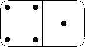
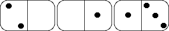

# Dominoes User Interface and Players 

+ This assignment is a group assessment. 
+ You should self-select your groups, which should have no more than four members.
+ One member of the group should be elected team leader.

------

You are required to implement ["The game of dominoes"][doms]. 

## Overview

Dominoes is a game played with a set of tiles, also known as *bones*, labelled with two numbers, from 0-6. 
There are 28 bones total. The goal is to win rounds by getting rid of all the bones in your hand, or if neither player can play, having the lowest *weighted hand*. 

- The *weight* of a hand is the sum of all the numbers on the bones in your hand. 
- The winner of the round receives a number of points equal to the weight of the loser’s hand. 
- The game is over after a specified number of points.

In a two-player game, each player starts a round of the game by taking seven bones. The leftover bones are known as the *boneyard*. The game can start either by a random player drawing the eighth tile from the boneyard and playing it immediately or by the player with the highest doublet (a tile that has the same numbers on each half) playing first. For the remainder of the game, the players take turns playing bones from their hands. A player can play a bone on the table by matching a number on their bone to a bone on the ends of the layout (the bones that have been already played). 

There are only two possible places to play each turn, one on the left and one on the right of the layout. 
For example, in the following layout, a player can play either a bone with two dots on the left of the layout or a bone with three dots on the right of the layout by matching up the number of dots.  The number on the other side of the domino (the one not matched), will become the new left or right-hand number of the layout.

- If a player cannot play, then they must draw bones from the boneyard until they can play. 
- If the boneyard is empty, then the player must pass their turn. 
- The round ends when a player has played all their bones, or when both players pass. 
- The winner is the player with the lowest weight hand, and collects points equal to the weight of the loser’s hand. 
- The game is over when a player scores a predetermined number of points (usually 100).

## Details

The main gameplay driver is provided for you, so the rules of the game are already programmed. 
You are to provide implementations of 

+ a *computer player*, 
+ an *interactive player*, and 
+ a *user interface*. 

The `Java` interfaces for the players and the user interface are provided and must be adhered to for the gameplay *driver* to work correctly.

+ The computer player implementation can be pretty simplistic, or as smart as you wish. Examples might be picking a random tile to play, or just picking the first playable tile.
	
+ The interactive player implementation must allow a user to choose the bone in their hand to play, and which end of the table to place the tile.

+ The user interface, must provide the following functionality:
	+ A way to specify the number of points necessary to win a game.
	+ A way to select whether a player is interactive or a computer player. Therefore, a player can play against the computer, the computer against itself, or two players can play.
	+ A way to start a new game at any time.
	+ Show the current round of the game.
	+ Show the number of bones a computer player has.
	+ Show the bones that each interactive player has.
	+ Show the number of bones left in the boneyard.
	+ A view of the bones played on the table.
	+ A way for each interactive player to draw a tile from the boneyard.
	+ A way for each interactive player to pass their turn.
	+ Show the number of points each player currently has.
	+ Show who wins a round of the game.
	+ Show who wins the game.
	+ Display a message when a user attempts to make an invalid move.
	

The table and bone displays could be graphical (it is up to you), i.e., bones could look something like:

## Provided files

+ The dominoes class files (it is not worth disassembling these; your; `IDE` will probably do it anyway).
+ `Javadoc` documentation for those classes.

## Additional requirements

+ The implementations of the players must be in the package `dominoes.players`.
+ All other files must be in the `dominoes` package.
+ Each class must be in its own source file.
+ Correct usage must be made of field and method access modifiers.
+ You should make use of all the features provided by `Java 17`.
+ An *Agile* development approach should be followed with TDD for the classes you write.

## Submission

Only the *team leader* should "submit" the following (via the provided `GitHub` Classroom repo):

+ All the source files you write, in their correct hierarchical structure.
+ A *rich* commit history that clearly shows the involvement of each group member.
+ The [`Trello`][trello] board that you used to monitor the progress of your work, showing *who did what* and describing any problems the team encountered (in terms of coding).
	+ The boards should also show any testing you undertook, design decisions you made, etc. 

## Evaluation

Other than the usual criteria:

+ Each team member will receive the same grade.
+ Each member of the team must submit a short review of what the other members in the group did (this should be sent as a private `Teams` message), **NOT** on any of the channels. 
This review *document* (actually only a few lines) is confidential and its purpose is to expose *free-loaders*. 
+ No review = 0 grade.

------

[doms]: https://en.wikipedia.org/wiki/Dominoes
[trello]: https://trello.com/
